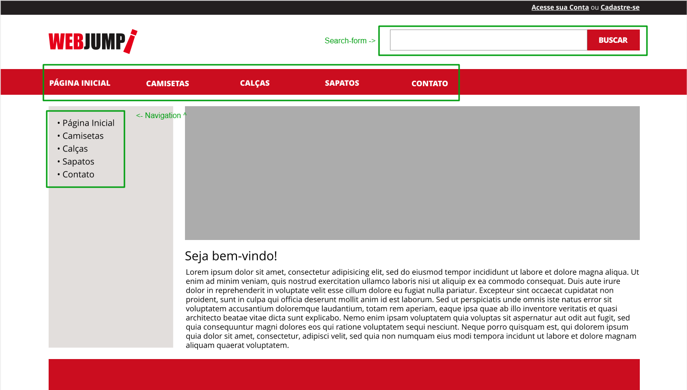
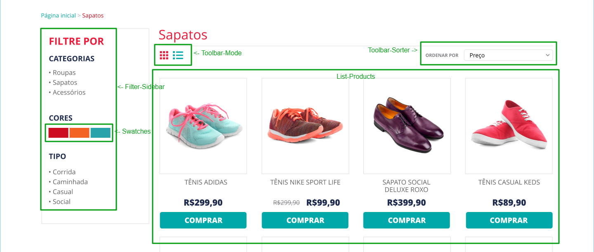

# WebJump Front-end Test
Repositório contendo um preview funcional de uma loja.


## Índice

- [Servidor](#servidor)
- [Páginas](#páginas)
- [Estilo](#estilo)
  - [Stylus](#stylus)
  - [Fonte](#fonte)
  - [SVGs](#svgs)
- [Implementção](#implementação)
  - [Index](#index)
  - [Componentes](#componentes)
  - [Handlers](#handlers)
  - [Serviços](#serviços)

## Servidor

Localizado na raiz do projeto, o arquivo [`app.js`](/app.js) utiliza o `Node` para implementar o ambiente para o projeto. A única modificação do arquivo foi a inclusão de uma função para criar rotas dinâmicas baseadas em um `array`.

## Páginas

As páginas de projeto foram criadas na raiz da pasta `./public`. Para cada categoria (baseada na API disponível) foi criada uma página `.html` que contém todo o conteúdo necessário para o seu funcionamento.

## Estilo

Os estilos do projeto estão separados em arquivos `.css` e folhas de estilo inseridas através da página `.html` que são carregados para dentro dos elementos usando o `ShadowDOM`.

#### Stylus

Como pré-processador foi utilizado o [Stylus](https://stylus-docs.netlify.app/) e arquivo final gerado ficou em `./public/css` e os de origem em `./public/styl`.

Para gerar o arquivo [`main.css`](./public/css/main.css) basta rodar `npm run css`.

#### Svgs

Os ícones foram implementados usando tags `svg` diretamente aonde precisam estar no `html`.

#### Fonte

Para a tipagem de todo o projeto foi utilizada a fonte [Open Sans](https://fonts.google.com/specimen/Open+Sans) fornecida pelo Google.
A fonte é inserida em todas as páginas usando tags `<link>` diretamente do site [fonts.google.com](https://fonts.google.com/specimen/Open+Sans).

## Implementação

Para o site ficar dinâmico foi adotado a utilização de [Custom Elements](https://web.dev/custom-elements-v1/) puros sem a utilização de framework.

#### Index

Em todas as páginas `.html` o arquivo [`index.js`](./public/js/index.js) é carregado como módulo:

```
<script defer type="module" src="./js/index.js"></script>
```

#### Componentes

Para cada componente custom há um arquivo para ele localizado em `./public/js/components`.

* [Swatches](./public/js/components/filters-swatches.js)
* [FilterSidebar](./public/js/components/filters.js)
* [ListProducts](./public/js/components/list-products.js)
* [Navigation](./public/js/components/navigation.js)
* [SearchForm](./public/js/components/search-form.js)
* [ToolbarMode](./public/js/components/toolbar-mode.js)
* [ToolbarSorter](./public/js/components/toolbar-sorter.js)

As páginas são compostas por todos eles como você pode conferir:


***


#### Handlers

Os arquivos handlers disponíveis em `./public/js/handler` são responsáveis por retornar uma lógica específica sem implementá-la diretamente.

##### filter-handler

Responsável pela filtragem do dado baseado em chave ele retorna uma função:

```
"color": (a) => {
  return (p) => {
    return p.filter[0].color == a
  }
}
```

> A lógica da função com chave "color" é implementada na mão baseada no retorno único da API: `filter: [{color: "Preto"}]`

##### sort-handler

Responsável por retornar a lógica de ordenação dos produtos para uma função [`Array.prototype.sort()`](https://developer.mozilla.org/pt-BR/docs/Web/JavaScript/Reference/Global_Objects/Array/sort):

```
"A-Z": (a,b) => {
  return b.name > a.name ? 1 : -1;
}
```

##### storage

O Storage é reponsável por chamar as funções responsáveis por fazer as requisições para a API usando os [serviços](#serviços) do projeto retornando o seu resultado. Exemplo de uso:

```
import dataAPI from "./handler/storage.js";

async function setStorage(){
  const catList = await dataAPI.getCategorie();
}
```

#### Serviços

Disponíveis em `./public/js/services` estão os arquivos responsáveis por fazer as requisições para a API.
